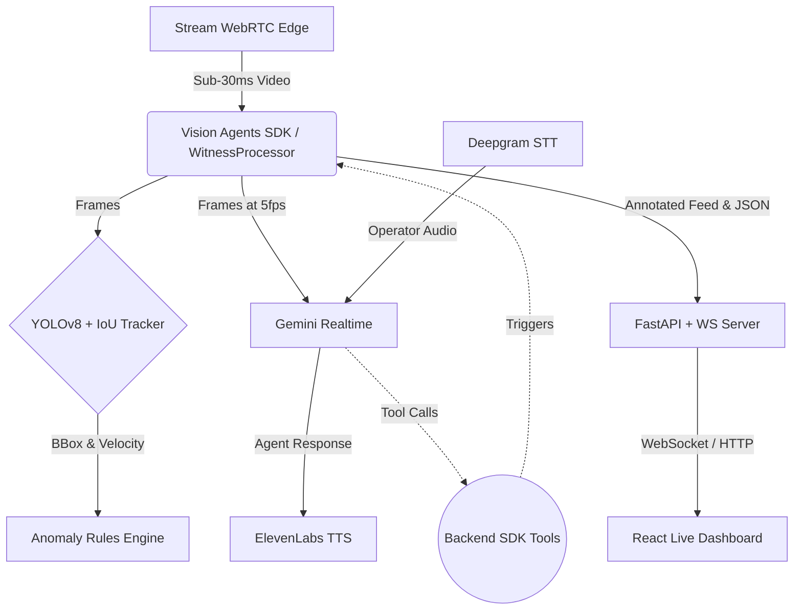

# 👁 WitnessAI
### Real-Time Crime Scene Intelligence Agent

**Built for the Vision Possible: Agent Protocol Hackathon 2026**

---

[](https://dev.to/divine_victor_e225cafa1f7/i-built-an-ai-that-witnesses-crimes-in-real-time-heres-why-i-had-to-18eg)
[](#live-demo)<!-- Add Live URL Here -->

## 📖 Introduction
WitnessAI transforms any live video feed into an **intelligent, always-on legal witness**. Unlike passive recording systems, it actively watches, listens, narrates aloud, and documents events in real-time. It acts as a pre-crime buffer, generating evidence packages complete with timestamped AI narrative reports and video clips down to the exact moment an anomaly occurs.

### 🔗 Important Links
- **Blog Post:** [I Built an AI That Witnesses Crimes in Real-Time. Here’s Why I Had To](https://dev.to/divine_victor_e225cafa1f7/i-built-an-ai-that-witnesses-crimes-in-real-time-heres-why-i-had-to-18eg)
- **Live URL:** [Insert Live URL Here]

---

## ✨ Key Features

- 🎥 **YOLOv8 + IoU Tracker**: Detects and tracks every person in the scene with object-level temporal awareness.
- 🧠 **Gemini Realtime (5fps)**: Watches the video actively and responds to voice questions contextually.
- 🎙 **Deepgram STT**: Allows operators to speak naturally (e.g., *"What do you see?*", *"Package the evidence."*).
- 🔊 **ElevenLabs TTS**: WitnessAI narrates incidents aloud the moment they occur.
- ⚙️ **SDK Function Tools**: Allows the Gemini model to call backend Python functions mid-conversation to query status, retrieve narrative reports, and trigger evidence packaging.
- 📊 **Live Operator Dashboard**: A React/FastAPI interface featuring an anomaly log, real-time metrics, narrative feed, and evidence downloads.
- 📦 **Auto Evidence Packages**: Automatically archives JSON reports + MP4 video clips upon confirmed incident detection.

---

## 🏗 Architecture Overview



Tools Exposed to Gemini:
- `get_agent_status()`
- `get_scene_description()`
- `get_incident_narrative()`
- `package_incident_evidence()`
- `list_evidence_packages()`

---

## ⚠️ Anomaly Detection Triggers

WitnessAI's rules engine actively monitors tracked entities for specific behavioral patterns:

| Anomaly | Detection Method | Default Threshold |
|---|---|---|
| **Loitering** | Stationary frames counter | 30 seconds |
| **Running** | Track velocity (px/sec) | 150 px/s |
| **Crowd Surge** | Person count in frame | > 8 persons |
| **Fall Detected**| Bounding box aspect ratio | width/height > 2.5 |

*(Configurable via the `.env` file)*

---

## 🗣 Voice Interaction Examples

Because WitnessAI is multimodal, you can interact with it via natural speech.

| Operator Says | WitnessAI Action |
|---|---|
| *"What do you see?"* | Calls `get_scene_description()`, narrates scene aloud |
| *"What happened?"* | Calls `get_incident_narrative('latest')`, reads full report |
| *"Package the evidence"* | Calls `package_incident_evidence('latest')`, saves data |
| *"How many packages do we have?"* | Calls `list_evidence_packages()`, reads count aloud |

---

## 🚀 Setup & Installation (3 Steps)

### Step 1: Get API Keys
All services used offer free tiers suitable for this project.

| Service | Used For |
|---|---|
| [GetStream](https://getstream.io/try-for-free) | WebRTC video edge (`STREAM_API_KEY`, `STREAM_API_SECRET`) |
| [Google AI Studio](https://aistudio.google.com) | Gemini Realtime Vision (`GOOGLE_API_KEY`) |
| [Deepgram](https://deepgram.com) | Operator Speech-to-Text (`DEEPGRAM_API_KEY`) |
| [ElevenLabs](https://elevenlabs.io) | Agent Text-to-Speech (`ELEVENLABS_API_KEY`) |

### Step 2: Install Dependencies

```bash
# Using the provided script:
bash setup.sh

# Or manually:
pip install fastapi uvicorn opencv-python-headless python-dotenv scipy
# For SDK mode: 
pip install "vision-agents[getstream,gemini,ultralytics,deepgram,elevenlabs]"
```

### Step 3: Configure & Run

1. Duplicate `.env.example` to `.env` and fill in your API keys.
2. Start the application:
   ```bash
   python main.py
   ```
3. Open your browser:
   - **Dashboard:** `http://localhost:8000` (or the port defined in `.env`)
   - **API Docs:** `http://localhost:8000/docs`

---

## 📁 Evidence Package Contents

When an anomaly triggers or an operator says "save the evidence", WitnessAI creates a locked record:

```text
evidence_packages/
└── {incident_id}/
    ├── {package_id}.mp4           ← 30s pre- and post-crime video
    └── {package_id}_report.json   ← Full immutable report
```
**JSON Report Includes:** Timestamped anomaly log, full LLM narrative, track ID metrics, confidence scores, and camera metadata.

---

## 🧪 Testing
WitnessAI includes a robust suite of 98 integration and unit tests.

```bash
python -m unittest tests.test_all tests.test_integration -v
# 98 tests, 0 failures, 6 skipped (SDK integration tests require real API keys)
```

---
*WitnessAI — The AI that doesn't just watch. It testifies.*
